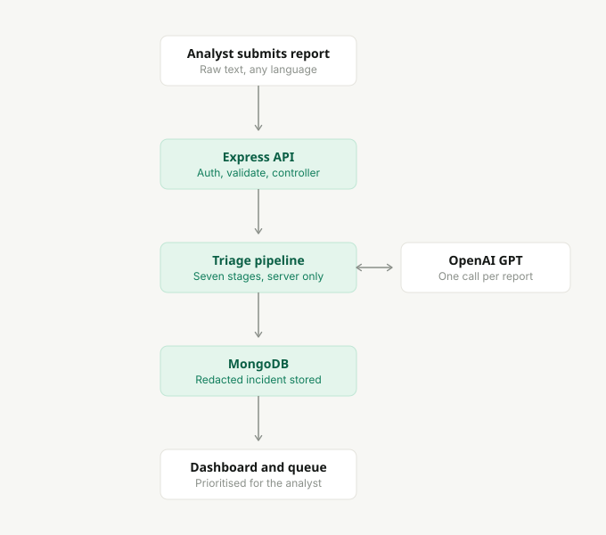
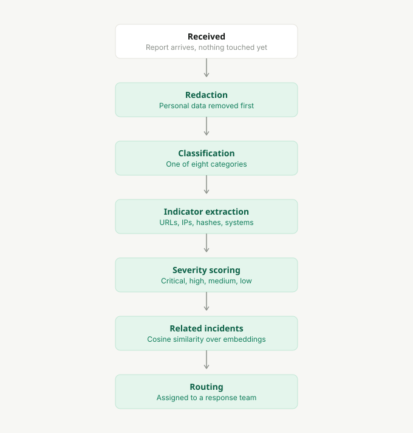
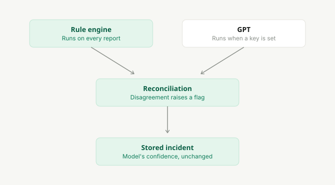

# Sentriq

**AI-powered cybersecurity incident triage — Track D (Government, Public Sector & National Data).**

Sentriq turns messy, unstructured incident reports — written in English or Nigerian Pidgin, by people who are not security analysts — into structured, prioritised, actionable incidents before a human has to read them.

```
Report → Redact PII → Classify → Extract indicators → Score severity → Embed → Detect related → Route → Dashboard
```



---

## Quick start

The fastest path needs nothing but Node 20+ and pnpm — no MongoDB, no API key:

```bash
pnpm install
```

```bash
pnpm demo
```

That boots the API against a throwaway in-process MongoDB, seeds 32 synthetic reports **by running them through the real pipeline**, runs the evaluation harness, and starts the client on http://localhost:3000.

Sign in with `analyst@sentriq.io` / `sentriq-demo` (the login screen pre-fills these outside production).

### Running against a real database

```bash
cp server/.env.example server/.env
cp client/.env.example client/.env.local
```

Set `MONGODB_URI` (local `mongodb://127.0.0.1:27017/sentriq` or an Atlas connection string) and, to enable GPT, `OPENAI_API_KEY`. Then:

```bash
pnpm seed && pnpm dev
```

| Command | What it does |
|---|---|
| `pnpm dev` | Client + API together, against `MONGODB_URI` |
| `pnpm demo` | Client + API against a throwaway in-memory MongoDB, seeded and evaluated |
| `pnpm seed` | Re-seed the database by replaying the synthetic dataset through the pipeline |
| `pnpm evaluate` | Score the pipeline against the labelled dataset and store the result |
| `pnpm build` | Production build of both packages |
| `pnpm typecheck` | Type-check both packages |

---

## Architecture



```
sentriq/
├── client/          Next.js 16 · React 19 · TypeScript · Tailwind v4 · shadcn/ui · TanStack Query
├── server/          Node · Express · TypeScript · MongoDB · Mongoose · OpenAI
├── pnpm-workspace.yaml
└── README.md
```

**The server owns the entire pipeline.** The client never classifies, redacts or scores anything — it submits a report and renders what came back. That separation is what makes the pipeline testable (see `pnpm evaluate`) and what stops two clients disagreeing about the same incident.

### Server (MVC)

```
server/src/
├── controllers/     Thin HTTP layer — no business logic
├── models/          Mongoose schemas (Incident, User, Counter, EvaluationRun)
├── routes/          Route tables + auth and validation middleware
├── services/        Everything that decides anything
│   ├── ai.service.ts             the single GPT entry point
│   ├── redaction.service.ts      step 2
│   ├── classification.service.ts step 3
│   ├── indicator.service.ts      step 4
│   ├── severity.service.ts       step 5
│   ├── embedding.service.ts      vectorisation
│   ├── similarity.service.ts     step 6
│   ├── routing.service.ts        step 7
│   ├── triage.service.ts         the orchestrator
│   ├── incident.service.ts       persistence + dashboard aggregation
│   ├── seed.service.ts           synthetic dataset loader
│   └── evaluation.service.ts     the measurement harness
├── middlewares/     auth · validation · error handling
├── validators/      Zod request schemas
└── scripts/         seed · evaluate
```

### Client

```
client/src/
├── app/             Routes. `(app)` is the authenticated shell; `/login` sits outside it
├── components/      ui · layout · dashboard · charts · incidents · forms
├── features/        Screen-level composition (dashboard, incidents, analysis)
├── hooks/           TanStack Query hooks — the only thing components consume
├── services/        Every HTTP call. Components never touch axios
├── config/          Design tokens, navigation
└── types/           Domain types, mirroring the server's
```

Strict layering: **service → hook → component.** A component that wants data calls a hook; the hook calls a service; the service is the only thing that knows axios exists.

---

## API

| Method | Route | Notes |
|---|---|---|
| `POST` | `/api/incidents` | Runs the full pipeline and returns the incident plus per-stage timings |
| `GET` | `/api/incidents` | `search`, `severity`, `category`, `status`, `team`, `filter`, `sort`, `page`, `limit` |
| `GET` | `/api/incidents/:id` | Redacted report only |
| `GET` | `/api/incidents/:id/related` | Related incidents with similarity scores |
| `GET` | `/api/incidents/:id/original` | **Role-gated and logged. Not used by the UI.** The un-redacted report |
| `PATCH` | `/api/incidents/:id` | Status, severity, team, title |
| `DELETE` | `/api/incidents/:id` | Lead role only |
| `GET` | `/api/dashboard/stats` | Totals, severity split, category split, teams, recent, timings |
| `GET` | `/api/routing-rules` | The rule set plus live per-team volumes |
| `GET` | `/api/evaluation` | The most recent evaluation run |
| `POST` | `/api/auth/login` · `GET /api/auth/me` · `GET /api/auth/config` | JWT |
| `GET` | `/api/health` | Status, database, and which engine is live |

`originalReport` is stripped from **every** payload, and no screen in the client can reveal it. The endpoint above exists for out-of-band evidentiary access only: it requires the `lead` role and writes an audit line naming who read what.

---

## How the pipeline works

### Hybrid by design, not by accident



The PRD is explicit that predictable data should be handled by code rather than a model, and Sentriq takes that further: **the rule engine runs on every report even when GPT is available**, and the two are reconciled.

| Stage | Rules | GPT |
|---|---|---|
| Redaction | phone, email, account, ID, money | names, internal system names, addresses |
| Classification | weighted keyword engine across 8 categories, incl. Pidgin phrasings | contextual classification |
| Indicators | URL, domain, IP, hash, email | affected systems, named accounts |
| Severity | 11 impact factors, 4 mitigations, category baselines | reasoning over context |
| Routing | ordered policy rules | *never involved* |

Reconciliation rules:

- **Classification** — GPT's category and its own confidence are published untouched. Where the rule engine disagrees, that is shown as a flag on the incident and in the queue, not folded into the score. The rule engine's "confidence" is a keyword-weight score rather than a probability, so blending the two made the published number mean less — and it marked down correct answers whenever the keywords matched an earlier stage of the same attack.
- **Severity** — GPT may escalate freely but may only de-escalate by **one level** from the rule score. Under-calling a real compromise costs far more than over-calling one.
- **Indicators** — a rule-extracted value can never be removed by the model.

### Without an API key

Set no `OPENAI_API_KEY` and everything still runs: the deterministic engine classifies, scores and routes, and a hashed bag-of-words vector handles similarity. Every incident records which engine produced it, and the UI says so. This is what makes the system demonstrable offline — and it is also the control the evaluation measures GPT against.

### Related incidents

Reports are embedded and compared by cosine similarity. Two backends behind one function:

- **MongoDB Atlas Vector Search** (`VECTOR_SEARCH_ENABLED=true`) — the production path.
- **In-process cosine** over recent incidents — correct, just O(n). The default, so a local Mongo works.

Semantic and lexical vectors live on different scales, so the thresholds are per-space (`SIMILARITY_THRESHOLD` / `LEXICAL_SIMILARITY_THRESHOLD`) rather than one global number that would be wrong for both.

### What gets redacted, and what does not

Personal data is removed: names, phone numbers, emails, account numbers, addresses, money amounts, national ID numbers, and internal system names.

**URLs, IPs, domains and hashes are deliberately kept.** They are indicators of compromise, not personal data, and an analyst cannot act on a blocklist entry that has been replaced with a token. Set `REDACT_TECHNICAL=true` to redact them too.

Titles are built from the **redacted** text and scrubbed against everything the redactor found — a title leaks onto the dashboard, the queue and every related-incident card, so it is the last place personal data should reappear.

---

## Evaluation

`pnpm evaluate` replays the labelled dataset through the live pipeline and measures five things, keeping every failure. Results are stored and rendered at `/evaluation`.

Current numbers, **rules-only engine** (no `OPENAI_API_KEY`), 32 labelled reports:

| Metric | Result |
|---|---|
| Classification accuracy | ~91% |
| Severity accuracy (exact) | ~59% — ~97% land within one level |
| Indicator extraction (recall) | ~76% |
| PII detection (recall) | ~59% |
| Duplicate detection (recall) | 100%, with 5 false positives at the lexical threshold |

Read these honestly:

- **PII recall is the weakest number and that is the point.** Everything the rules miss is a personal name or an internal system name — categories with no fixed shape, which is exactly what the model is for. With a GPT key this metric is the one that moves most.
- **Severity exact-match looks low** because the label set is strict and the scale is only four wide; "within one level" is the number that reflects analyst usefulness.
- **Duplicate false positives are real.** The lexical threshold is tuned for recall, because a missed duplicate means an analyst reads the same campaign twice, while a false positive is one click to dismiss.
- **Known misses** are listed in full on the Evaluation screen, including the vishing report that the rule engine calls Phishing and the legitimate password-expiry notice it flags as suspicious.

The dataset (`server/src/data/dataset.ts`) is entirely synthetic: 32 reports across all 8 categories, both languages, benign noise, true duplicates, and "similar but unrelated" pairs designed to catch a naive similarity check. No real personal data appears anywhere.

---

## Design

The interface follows the supplied design system exactly. Three colour roles and no exceptions:

- **Neutrals** carry the interface.
- **Signal Jade** always means *the system* — Sentriq's own actions, confidence and matches. Jade is never used to express severity.
- **Severity hues** are the only other colours permitted.

Violet is reserved for "PII / handled by policy", which is why the Triaged status pill and redaction tokens share it.

Every machine-generated value — IDs, IPs, URLs, hashes, confidence, timestamps, similarity scores — is IBM Plex Mono. Human prose never is. Cards are flat: a 1px line and no shadow; only popovers and drawers lift.

The living component sheet is at `/design-system` and renders the same components the product uses, so it cannot drift.

---

## Authentication

Deliberately small (PRD §13): one seeded admin, JWT, protected API routes, protected client routes. Two roles exist — `analyst` and `lead` — and `lead` exists only to gate the un-redacted original report, which is reachable through the API but not through any screen.

The JWT is kept in a readable cookie so the Next.js edge can gate navigation without a server session. That is a scope simplification, not a recommendation: a production build would use an HttpOnly cookie set by the API. The cookie is never trusted for authorisation — presence gates navigation, and the API verifies the signature on every request.

---

## Configuration

Both packages ship a `.env.example`. The settings that matter:

| Variable | Default | Effect |
|---|---|---|
| `MONGODB_URI` | `mongodb://127.0.0.1:27017/sentriq` | Local or Atlas |
| `OPENAI_API_KEY` | *(empty)* | Empty runs the deterministic engine |
| `OPENAI_MODEL` | `gpt-4o-mini` | Classification, severity, contextual PII |
| `OPENAI_EMBEDDING_MODEL` | `text-embedding-3-small` | Related-incident search |
| `VECTOR_SEARCH_ENABLED` | `false` | `true` uses Atlas `$vectorSearch` |
| `REDACT_TECHNICAL` | `false` | `true` also redacts URLs, IPs and hashes |
| `AUTH_ENABLED` | `true` | Must match the client's `NEXT_PUBLIC_AUTH_ENABLED` |

### Atlas Vector Search

Create a vector index named `incident_embedding_index` on the `incidents` collection:

```json
{
  "fields": [
    { "type": "vector", "path": "embedding", "numDimensions": 1536, "similarity": "cosine" }
  ]
}
```

`numDimensions` must match your embedding model (1536 for `text-embedding-3-small`). Then set `VECTOR_SEARCH_ENABLED=true`. If the index is missing, the server logs a warning and falls back to in-process cosine rather than failing the request.

---

## Deployment

- **Client** → Vercel. Set `NEXT_PUBLIC_API_BASE_URL` to the deployed API's `/api`.
- **Server** → Railway, Render or Fly.io. `pnpm -F @sentriq/server build && pnpm -F @sentriq/server start`.
- **Database** → MongoDB Atlas. Set `CORS_ORIGIN` to the client's origin and a real `JWT_SECRET`.

---

## Known limitations

- Similarity search is O(n) unless Atlas Vector Search is enabled. Fine for this scale, not for millions of incidents.
- The submit screen's stepper advances optimistically while the request is in flight, because `POST /api/incidents` is a single round trip. Stage notes stay blank until the server's real timings arrive, so the UI never shows a result it has not been told — but true streamed progress would need SSE.
- Reassignment cycles through teams rather than offering a picker.
- The mobile sidebar is a drawer reusing the desktop navigation; the handoff flagged that layout as undesigned.
- Pidgin coverage in the rule engine is hand-built from the dataset's phrasings. It generalises less well than the model does.
